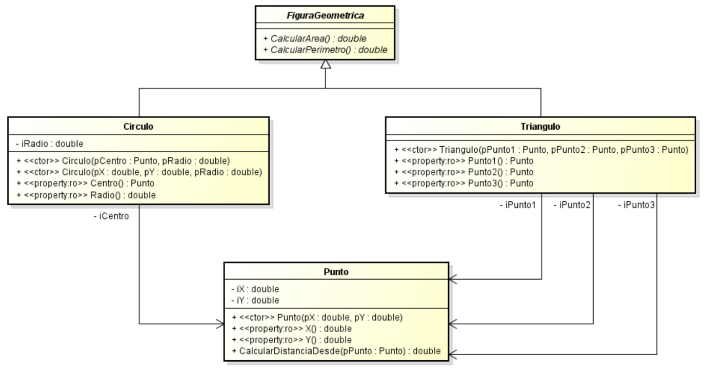

# Trabajo Práctico N°3

## Ejercicio 1

Implemente el diagrama de clase que está al final del enunciado de este ejercicio. Los
métodos _Correr_ y _Saltar_ de la clase abstracta _Animal_ imprimen por pantalla las cadenas de
texto “corriendo” y “saltando” respectivamente. Cada instancia particular de las subclases
de la clase _Animal_ implementa el método _HacerRuido_ con la impresión por consola de
texto de su sonido característico. Implemente dos subclases de Animal adicionales además
de las presentes.

Al desarrollar este ejercicio utilice un arreglo con los dos tipos de animales suministrándola
a una instancia de la clase _Veterinaria_. Dicha clase en su único método itera el arreglo
pasándole el mensaje _HacerRuido_ a todas las instancias de la clase _Animal_.

Nota: El objetivo de este ejercicio es la demostración de uso de la característica
polimorfismo, por ello no es necesario realizar una fachada. Este ejercicio incurre en una
técnica no recomendable que es la mezcla de código de presentación (la impresión por
consola del sonido) y de código de dominio, pero se realiza por fines educativos y para
mostrar más claramente el concepto.

## Ejercicio 2

Modifique el ejercicio 1 del trabajo práctico 2 para adaptarlo al siguiente diagrama de
clases:

## Ejercicio 3

Diseñe y desarrolle una aplicación que dada diferentes salas de guardia de un hospital,
permita gestionar la atención de pacientes en la misma. Suponga que el hospital cuenta
únicamente con dos salas de guardia, una de consultas y otra de urgencias.

Dependiendo de la sala en la que los pacientes sean admitidos, se utilizarán dos criterios o
algoritmos diferentes para la selección del próximo paciente a ser atendido:
- FIFO: el paciente que más antiguamente se encuentra en espera, debe ser el primero
en ser llamado para su atención.
- Triaje: el próximo paciente a ser llamado para su atención se determina de acuerdo
al nivel de urgencia que presenta una valoración diagnóstica inicial, clasificándose
el mismo en diferentes niveles. Ante dos pacientes que tengan el mismo nivel de
urgencia, se debe atender primero al que mayor tiempo lleva esperando. Ordenados
descendentemente en orden de prioridad, los niveles son:
  - Nivel 1 (rojo): atención inmediata.
  - Nivel 2 (anaranjado): emergencia.
  - Nivel 3 (amarillo): urgente.
  - Nivel 4 (verde): menos urgente.
  - Nivel 5 (azul): no urgente.

La sala de consultas utiliza el criterio FIFO, mientras que en la sala de urgencias se usa el
Triaje
Identifique la generalización para modelar los algoritmos, de tal forma que sean
intercambiables entre sí. Considere la utilización de patrones de diseño, de los cuales se
recomienda utilizar algunos de los siguientes: _Strategy, Template Method, Decorator_.

Para simplificar el ejercicio, al inicializar la aplicación se debe precargar en forma aleatoria
un arreglo por sección con 10 turnos cada uno.
Utilice el patrón _GRASP Controlador de Fachada_, para desacoplar la lógica del sistema de
la interfaz de usuario.

## Ejercicio 4

Se recibe un requerimiento para desarrollar un software que permita encriptar y
desencriptar cadenas de caracteres utilizando diferentes algoritmos de encriptación, los
cuales deben ser fácilmente intercambiables.

Para satisfacer al requerimiento, el diseñador del equipo realiza el diagrama de clases que
se puede observar a continuación. En el diseño se utiliza el patrón de diseño GOF
_Estrategia_ para definir los diferentes algoritmos de encriptación, los cuales respetan una
interfaz común. También se hace uso de una _Factoría_ implementada mediante el patrón
Singleton para la obtención de los encriptadores particulares.

Adicionalmente, el diseñador brinda los siguientes detalles:
- La interface _IEncriptador_ establece el contrato mínimo que deben cumplir todos los
algoritmos de encriptación.
- La clase abstracta _Encriptado_r sirve como clase de base para los diferentes
encriptadores que se deseen implementar, agregando la responsabilidad de nombrar
al encriptador.
- La clase _EncriptadorCesar_ encapsula la lógica que permite encriptar y desencriptar
cadenas utilizando el algoritmo de cifrado César, permitiendo establecer el
desplazamiento que se aplicará sobre el alfabeto. El constructor de esta clase invoca
al constructor de la superclase proporcionándole el nombre “César”.
- La clase _EncriptadorAES_ tiene la responsabilidad de realizar la encriptación y
desencriptación de cadenas utilizando el algoritmo _Advanced Encryption Standard_ o
_Rijndael_. El constructor de esta clase invoca al constructor de la superclase
proporcionándole el nombre “AES”.
- La clase _EncriptadorNulo_ es la implementación del patrón _Null-Object_ de la
interface _IEncriptador_, donde los métodos encriptar y desencriptar devuelven la
misma cadena proporcionada como parámetro. El constructor de esta clase invoca al constructor de la superclase proporcionándole el nombre “Null”. Debe evitarse que
esta clase pueda extenderse.
- La clase _FabricaEncriptadores_ es un _Singleton_ que es responsable de crear y
mantener una instancia de cada implementación de la interface _IEncriptador_.
El método _GetEncriptador_ devuelve la instancia de _IEncriptador_ cuyo nombre
coincide con el parámetro proporcionado. Si el nombre proporcionado no existe,
entonces se debe devolver una instancia de _EncriptadorNulo_.

Se deben implementar dos encriptadores adicionales además de los presentes en el
diagrama.

Se deben identificar las operaciones del sistema utilizando el patrón de diseño _GRASP
Controlador de Fachada_ para desacoplar la lógica del sistema de la interfaz de usuario.

Utilice pruebas unitarias para validar el comportamiento de los encriptadores.

Nota: Para la implementación del algoritmo de AES se recomienda utilizar las clases
provistas por .NET.
